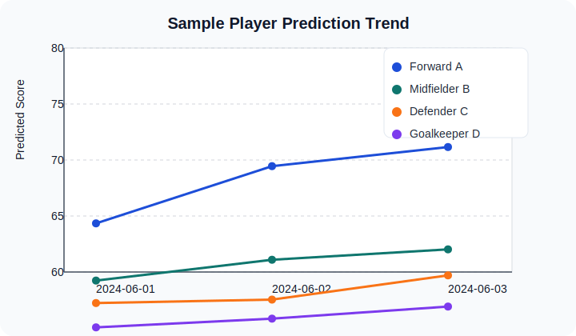
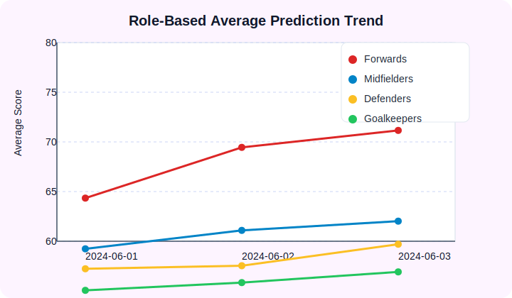
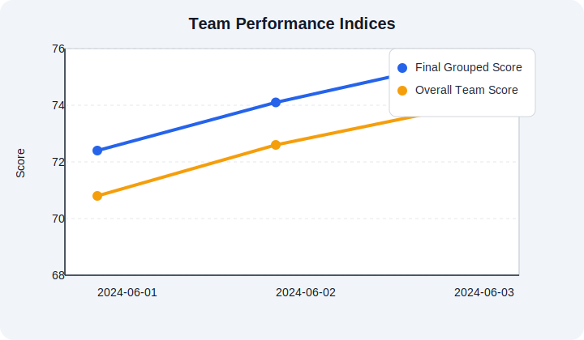
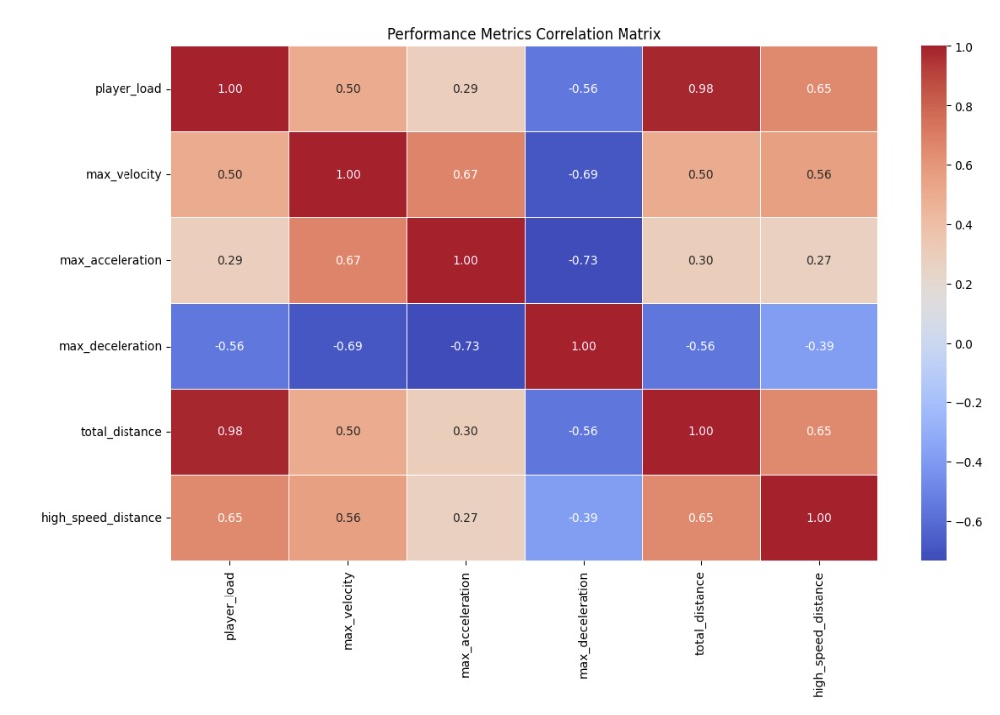
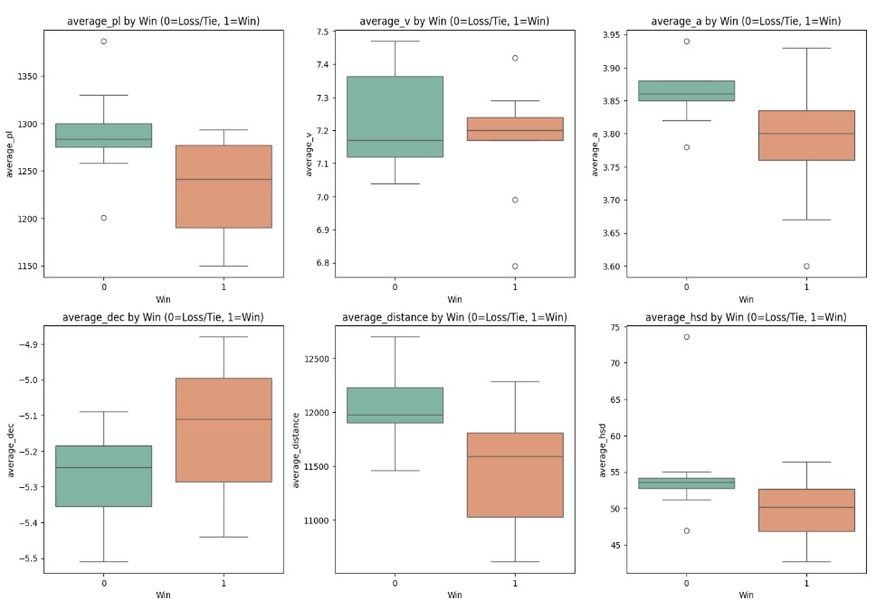
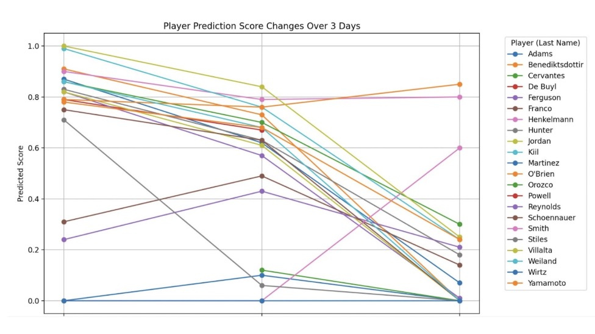

# Athlete Performance Analytics

A consolidated toolkit for turning Catapult athlete-tracking exports into model-ready datasets, daily performance
predictions, and presentation-ready visuals. 

## Executive Snapshot

- **Data collection** scripts (under `src/data_collection/`) fetch activity schedules, attach athlete rosters, and pull
  per-athlete sensor metrics through the Catapult API.
- **Modeling** utilities (in `src/modeling/`) aggregate sensor data, fit a regression model against match-day
  benchmarks, and generate daily prediction summaries.
- **Visualization** tools (in `src/visualization/`) turn prediction JSON into lightweight plots or export-ready PNGs
  while anonymising player names by default.
- **Data hygiene**: only synthetic samples live in `data/sample/`. Real exports are expected in `data/raw/` (ignored from
  git) to keep the repository safe to share.

## Report Highlights

<div style="background:#f8fafc;border-radius:12px;padding:24px;margin-bottom:24px;">
  <h3 style="margin-top:0;">Player Momentum Over Three Sessions</h3>
  <p>The synthetic example shows a forward gaining match-readiness faster than other positions. Midfielders edge upwards,
  while defenders and the goalkeeper remain comparatively flat — a useful cue for targeted load adjustments.</p>
  
</div>

<div style="background:#fdf4ff;border-radius:12px;padding:24px;margin-bottom:24px;">
  <h3 style="margin-top:0;">Positional Group Readiness</h3>
  <p>Average scores by unit reveal forwards leading the training response, with goalkeepers trending upward from a lower
  baseline. This view is handy when aligning conditioning plans with tactical priorities.</p>
  
</div>

<div style="background:#f1f5f9;border-radius:12px;padding:24px;">
  <h3 style="margin-top:0;">Overall Team Outlook</h3>
  <p>The combined indices indicate steady improvement across the squad. The gap between the grouped score and the full-team
  average narrows, signalling better depth readiness as training progresses.</p>
  
</div>

## Athlete Readiness Report (Project Notes)

The consolidated tooling builds on an internal “Athlete Readiness” study that set out to help Santa Clara coaches keep
players healthy and prepared on match day. The original work pulled together Catapult tracking data, VALD jump metrics,
and match outcomes to understand how training intensity translated into results while keeping fatigue in check.

### 1. Introduction

- Coaches needed a fast pulse on whether pre-match preparation was driving peak performance while minimizing injury risk.
- Data from Catapult (load, velocity, acceleration, deceleration, distance, high-speed distance), VALD (jump height,
  contraction time, RSI-mod), and Output (match outcomes) formed the basis of the analysis.
- API access delays and messy payloads required iterative cleaning, aggregation, and schema alignment before modeling was
  viable.

### 2. Data and Integration

- **Collection**: Catapult supplied training + match metrics; VALD provided fatigue indicators; Output delivered opponent
  context and final results.
- **Aggregation**: Workflows distinguished match days (`MM-DD-YY`) from training days (`MM-DD-YY-1`, etc.), allowing
  targeted analysis of the lead-up to each game.
- **Outcome merge**: Win/loss labels (1 for wins, 0 for losses/ties) were standardized and joined to training aggregates,
  yielding a unified table that fed the downstream models.

### 3. Implementation & Findings

- **Win/Loss Prediction**: Logistic regression on day-before-match training metrics reached ~77% accuracy on a small test
  set. Deceleration emerged as the only moderately influential feature; other coefficients were minimal due to limited
  samples.
- **Clustering**: K-Means on per-athlete, normalized metrics exposed a dominant cluster with strong distance/high-speed
  numbers plus outliers that may signal unique conditioning needs (subject to context such as injuries or reduced
  minutes).
- **Linear Regression**: A model predicting “percentage of max-day intensity” provided coaches with an immediate sense of
  how rigorous a given session was relative to match demands. The approach mirrors European training systems that tier
  sessions by intensity to balance conditioning and recovery.
- **Visuals**: Correlation matrices, win/loss plots, and day-over-day prediction charts were used to communicate insights
  (new PNG exports can be dropped into `reports/assets/` and referenced below).

### 4. Challenges & Next Steps

- Integrating APIs with inconsistent identifiers was the largest pain point; custom mapping layers were required.
- Dataset size constrained model choice — simpler linear/logistic approaches outperformed deep learning or XGBoost in
  this context.
- Future improvements include collecting additional seasons, standardizing IDs across systems, experimenting with
  alternative models (SVMs, ensembles), and incorporating VALD fatigue metrics directly into readiness scoring.
- Adding fresh PNG or SVG exports for correlation heatmaps, win/loss projections, and day-to-day score changes is as
  simple as placing them in `reports/assets/` and linking to them in this report section. Current reference visuals:

  <div style="display:flex;flex-direction:column;gap:24px;margin-top:16px;">
    <figure style="margin:0;">
      
      <figcaption style="font-style:italic;color:#475569;">Correlation matrix across key training metrics highlights overlapping loads and speed interactions.</figcaption>
    </figure>
    <figure style="margin:0;">
      
      <figcaption style="font-style:italic;color:#475569;">Logistic regression outputs vs. actual results illustrate the day-before-match readiness signal.</figcaption>
    </figure>
    <figure style="margin:0;">
      
      <figcaption style="font-style:italic;color:#475569;">Player-level predicted readiness trajectories over multiple sessions surface rising and falling readiness.</figcaption>
    </figure>
  </div>

## Repository Map

```
.
├── README.md
├── requirements.txt
├── data
│   ├── raw/             # Place real Catapult exports here (ignored by git)
│   ├── processed/       # Script outputs land here (ignored by git)
│   └── sample/          # Synthetic examples safe to share
├── models/              # Stored models (.pkl) created during training (ignored by git)
├── reports/
│   └── assets/          # Static visuals referenced by the README
└── src
    ├── data_collection/ # API fetchers and catalog builders
    ├── modeling/        # Feature aggregation, training, and scoring
    └── visualization/   # Plotting utilities
```

## Getting Started

1. **Install dependencies**
   ```
   python -m venv .venv
   source .venv/bin/activate
   pip install -r requirements.txt
   ```
2. **Prepare secrets**  
   Copy your Catapult API token into `.env` as `API_KEY=...`. The scripts fall back to the environment variable if you
   prefer exporting it.
3. **Ingest raw data**
   ```
   # 1. Build a catalog of activities with rosters
   python src/data_collection/build_game_catalog.py

   # 2. Pull per-athlete sensor metrics for each activity
   python src/data_collection/fetch_activity_metrics.py

   # 3. Produce recent activity snapshots with player names
   python src/data_collection/fetch_recent_activities.py --limit 3
   ```
4. **Model & predict**
   ```
   # Aggregate team-level features
   python src/modeling/team_metrics.py

   # Train the regression model & save benchmarks
   python src/modeling/train_model.py

   # Score the latest sessions
   python src/modeling/generate_daily_predictions.py
   ```
5. **Visualise results**
   ```
   python src/visualization/performance_trends.py \
     data/sample/predictions_sample.json \
     --output-dir reports/generated-plots
   ```
   Replace the sample JSON with the latest `data/processed/predicted_performance.json` to chart live results.

## Working With Sensitive Data

- Raw exports and processed metrics produced from actual athletes always stay inside `data/raw/` or `data/processed/`.
  Both directories are git-ignored by default.
- The provided synthetic files in `data/sample/` mirror the required schema so you can test the pipeline and plots without
  exposing real names.
- When sharing charts, use the anonymised defaults or run `performance_trends.py` without `--show-names`.

## Next Steps

- Extend the regression features with wellness or RPE inputs for context-aware predictions.
- Wire up automated daily jobs (e.g., via GitHub Actions or Airflow) to refresh predictions and publish the visuals.
- Layer unit tests around key transforms (`team_metrics.py`, `generate_daily_predictions.py`) as the schema stabilises.
